# Dublin Vinyl Club

Welcome to Dublin Vinyl Club, where the heartbeat of analogue music echoes through the vibrant streets of Dublin! Our website is a haven for those who crave an immersive musical journey, inviting you to explore a meticulously curated collection of classic and contemporary albums. Whether you're a seasoned audiophile, intimately familiar with the warm crackle of vinyl, or a newcomer eager to embark on a sonic adventure, Dublin Vinyl Club is your gateway to a community that shares your profound passion for music.

## Demo

A live demo can be found [here.](https://maikonschumann.github.io/portfolio-project1-vinylclub/)

- - - 

# Contents
* [Languages Used](#languages-used)
* [User Experience](#user-experience-ux)
* [Design](#design)
  * [Features](#features)
  * [Wireframes](#wireframes)
  * [Future Implementations](#future-implementations)
  * [Color Scheme](#color-scheme)
  * [Typography](#typography)
  * [Images](#images)
  * [Icons](#icons)
* [Deployment](#deployment)
  * [Run locally](#run-locally)
  * [Testing](#testing)
* [Credits](#credits)
* [Acknowledgements](#acknowledgements)

- - -

# Languages Used
* HTML5
* CSS3

- - - 

# User Experience (UX)

## The ideal users for this community is:
 * Individuals passionate about music. 
 * Based in Dublin.
 * Attend vinyl record fairs, conventions, or music events in Dublin area.
 * Check for local meetup groups focused on vinyl enthusiasts.

## User stories

### First Time Visitor Goals
 * As a new visitor to the website, I expect to easily to understand the main purpose of the site and navigate without complications. 
 * I can find what I search efficiently.
 * Learn more about the community for a comfortable introduction to the group.
 * Understand how to actively participate as a member.
 * Access social media links to explore the community's following and comments.

### As a Returning Visitor
 * I want to find precise information about the next session.
 * I want to fill a form to ask any questions if I needed.

### As a Frequent User 
 * I want to follow scheduled events.
 * I want to find quick access to social media links.

- - -

# Design

## Wireframes:

* Index Page:
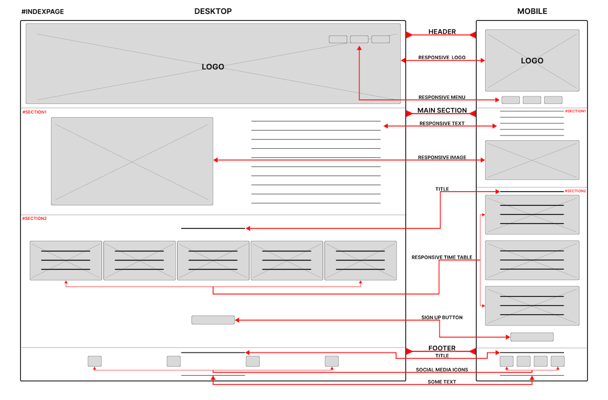

* About Page:
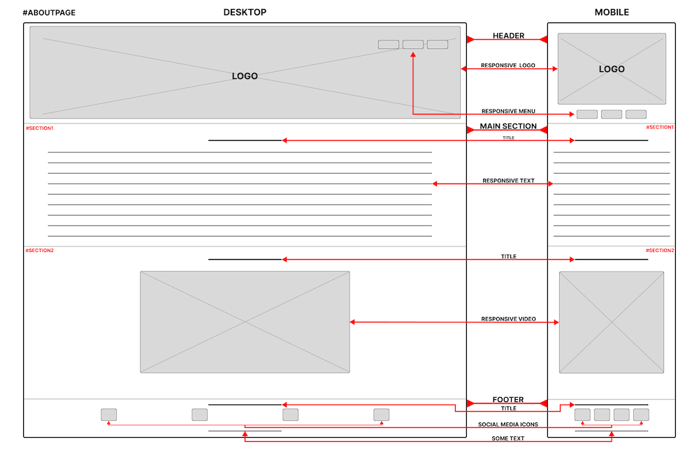

* Sign Up Page:
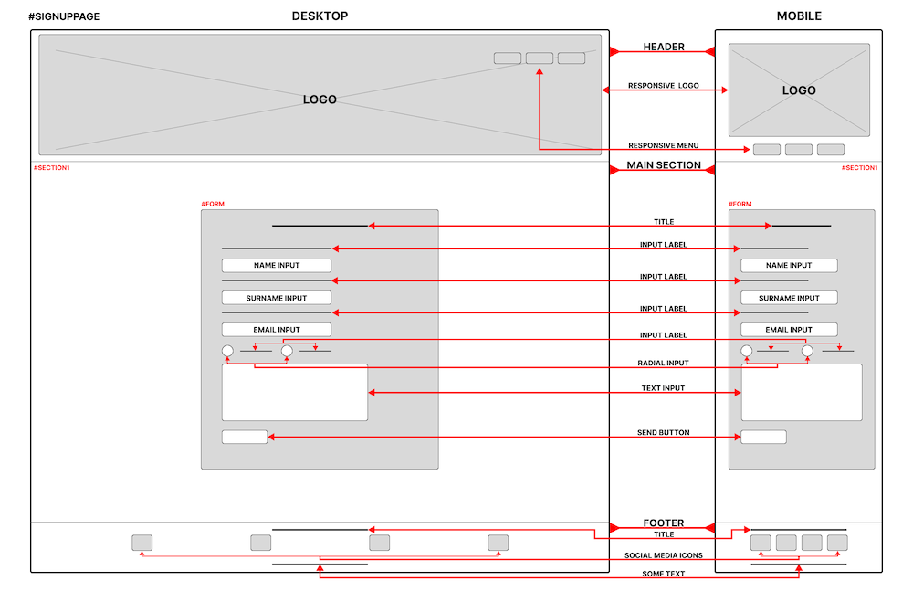

## Features

The website consists of three pages: the index page, the about page, and the signup page. Each page includes a **logo**, a **navigation bar**, and a **footer**.

# **Index page**

The **Home** page is divided into 3 sections, *header*, *main section* and *footer*.

## Header

The *header* features a *logo* and a *navigation bar* set against an intuitive image background, meticulously crafted to elevate user experience and make a lasting impact. **This distinctive header remains consistently visible across all pages**.

- - - 

## Main Section

The *main section* has two sections and a sign up button, the *hero section* and the *times section*.

### Hero Section

The *hero* features an image accompanied by a brief paragraph introducing the website, aiming to create a positive impact on the user.
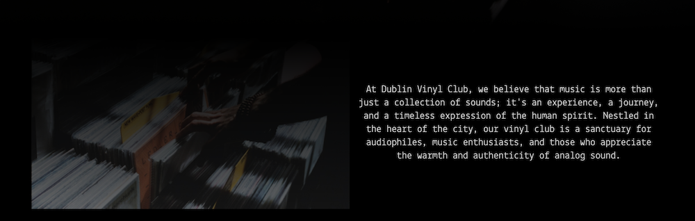

### Times Section

Below the image the user will find brief information to awake the interest to participate in the community.
After reinforcing the emotional response positively in the user, there are upcoming meetings with dates and locations.
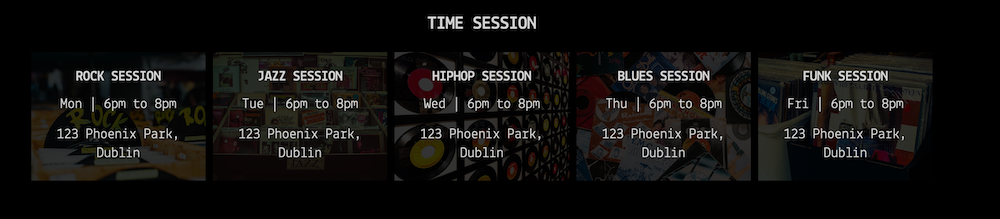

### Join Button

A *Join Button* near the end of the index page provides quick access to the signup page, allowing users to easily reach a destination where they can request any information they need.

- - - 

## Footer 

Footer Social Icons facilitate ongoing connection via our community's social platforms, encouraging users to stay connected effortlessly through social media. Links open in new tabs for user-friendly navigation. **This distinctive footer remains consistently visible across all pages**.

- - - 

# **About Us page**

The *About us* is also divided by 3 sections, *header*, *main section* and *footer*. The [Header](#header) and the [Footer](#footer) are the same as index page. 

## Main Section

### Who We Are Section

The **About** page is divided into two sections, a section with a *Who We Are* text providing future members with a balanced connection to the community without overwhelming them with information. Initially, the page shares the story of our community, followed by details about the vinyl experience. Subsequently, we elaborate on our commitment to our community of members, encouraging individuals to join our vibrant community.
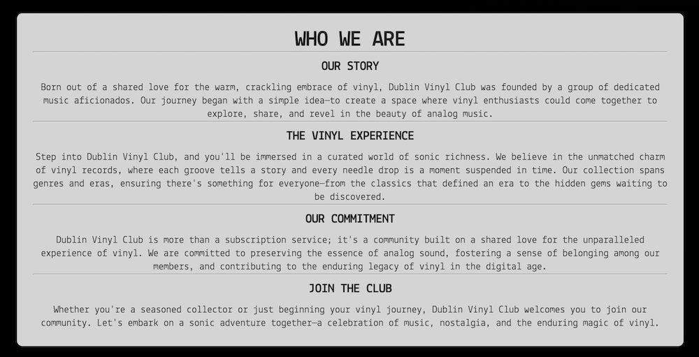

### Tips Section

Finally, at the bottom of the page (just above the footer), there is a video providing tips on how to take care of your classic vinyl records.
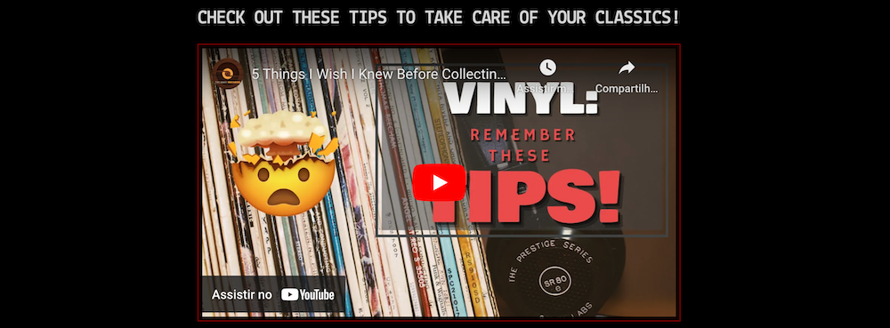 

- - - 

# **Sign Up page**

The *Sign Up page* is also divided by 3 sections, *header*, *main section* and *footer*. The [Header](#header) and the [Footer](#footer) are the same as index page. 

## Main Section

The **Sign Up** page features a user-friendly contact form, prompting for the user's name and email, with a dedicated area for leaving a message. Users can indicate whether they prefer to ask a question or dive right in. The form's bottom includes a "Send Message" button.
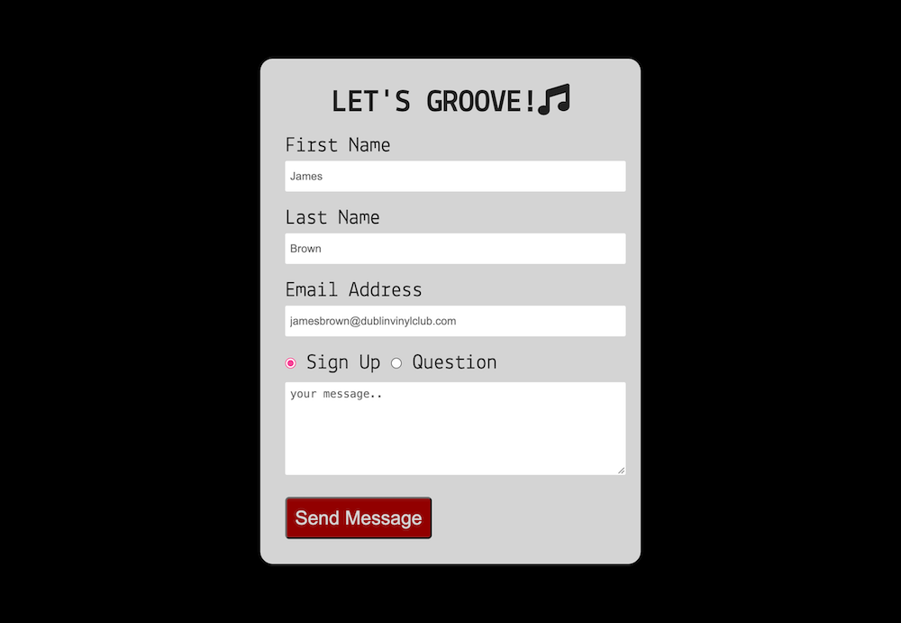 

- - -

# Future Implementations

Further development of the website, including the addition of more pages and improved responsiveness, will necessitate additional time and expertise.

- FAQ page - 
Develop a comprehensive FAQ page to address common user queries, reducing the need for direct support and improving user satisfaction.

- CAPTCHA - 
Implement CAPTCHA on signup form to prevent spam submissions and maintain the integrity of user interactions.

- Blog - 
Introduce a blog section with relevant articles to build user confidence, attract new members, and increase overall site traffic.

- Button back to the top - 
Enhance user navigation by adding a "Back to Top" button for quick and convenient scroll-free return to the page's beginning.

- Menu "hamburger" - 
Optimize responsiveness with a hamburger menu, particularly beneficial for mobile users. Ensure an intuitive and accessible menu structure.

- - - 

# Color Scheme

The black color scheme was selected to impart a modern, minimalist, and elegant aesthetic, without detracting from the visual impact of the images.

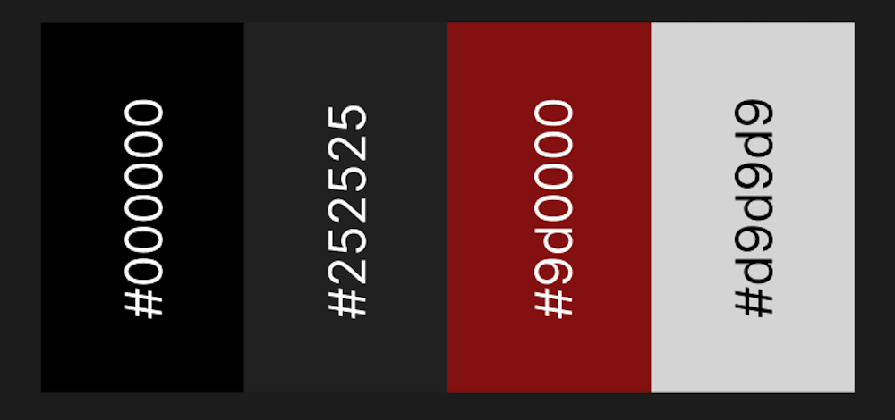

- - - 

# Typography

The website utilizes a singular font, specifically **Lekton** from **Google Fonts**, maintaining a uniform and cohesive typographic style.

- - -

# Images

All images on the website are from [Unsplash](https://unsplash.com/) and [Pexels](https://www.pexels.com), both under a free license agreement.

- - - 

# Icons
The website's icons are sourced from [Font Awesome](https://fontawesome.com/icons), and are covered under a free license.

- - - 

# Deployment

The site is hosted on GitHub Pages, deployed directly from the master branch. Automatic updates to the deployed site occur with each new commit to the main branch. It's essential that the landing page is named index.html for correct deployment on GitHub Pages.

To deploy the page on GitHub Pages from its [GitHub repository](https://github.com/MaikonSchumann/portfolio-project1-vinylclub), the following steps were executed: 
1. Login or Sign Up to GitHub.
2. Open the project repository.
3. Select **Settings** from the top menu.
4. Click on "Pages" in the left hand navigation panel.
5. In the "Source" section, choose the branch to deploy (Main for newer repositories, Master for older ones).
6. Select the deployment folder, typically "/root".
7. Click "Save" and wait for the deployment process to complete.
8. Your URL will be shown above the "Source" section.

## Run locally
**Fork:**
1. Login or Sign Up to GitHub.
2. Open the project [repository](https://github.com/MaikonSchumann/portfolio-project1-vinylclub).
3. Click the Fork button in the top right corner.

**Clone:**
1. Login or Sign Up to GitHub.
2. Open the project [repository](https://github.com/MaikonSchumann/portfolio-project1-vinylclub).
3. Click on the "Code" button, choose your preferred cloning method (HTTPS, SSH, or GitHub CLI), and copy the provided link.
4. Open your preferred code editor's terminal and navigate to the desired location for the cloned directory.
5. Type 'git clone' in the terminal, paste the link from step 3, and press enter.

- - -

# Testing 
The site is designed to smoothly operate, making it easy for users to achieve their goals. Chrome development tools were utilized to catch and fix any issues during the development process. Performance testing was conducted through both manual and automated methods.

## Functionality

1. Validation for syntax errors on every page of the project was conducted through the utilization of the W3C Markup Validator and W3C CSS Validator Services.

  * Index Page
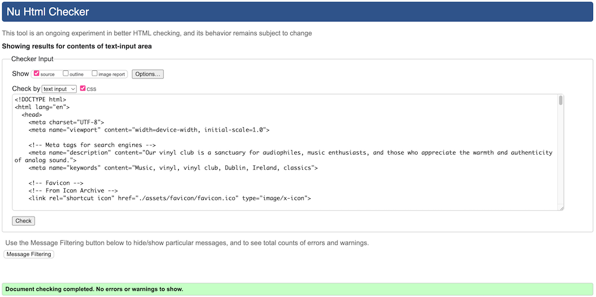
  * About Page

  * Sign Up Page

  * CSS Page
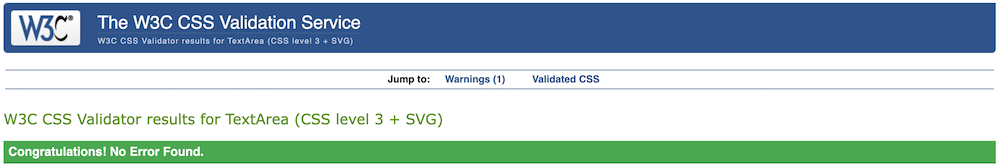

2. Lighthouse within the Chrome Developer Tools are used to test performance, accessibility, best practices and SEO of the Dublin Vinyl Club Website.
 * Index Page
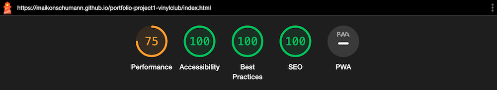
  * About Page
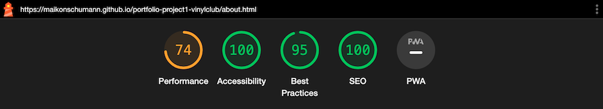
  * Sign Up Page
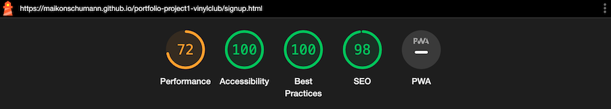

## Usability
The Navigation was tested. The menu is easily visible, consistent on all webpages. The users find resources on the site intuitively.

## Compatibility 
The website is optimized to display correctly on a variety of browsers and screen sizes. The compatibility was checked by testing on Chrome, Firefox, Safari, and Edge.

## Responsiveness
Checked responsiveness using Chrome DevTools on various screens like iPhone 5 (320px wide) and 5k iMac Pro (5120x2880px). Used media queries for more responsiveness.

- - - 

# Credits

All images on the website are from [Unsplasch](https://unsplash.com/) and [Pexels](https://www.pexels.com), both under a free license agreement.

All content was written by me.

- - -

# Acknowledgements
* I appreciate my family's patience as I dedicate considerable time to coding.

* My Mentor Lauren-Nicole Popich for continuous helpful feedback.